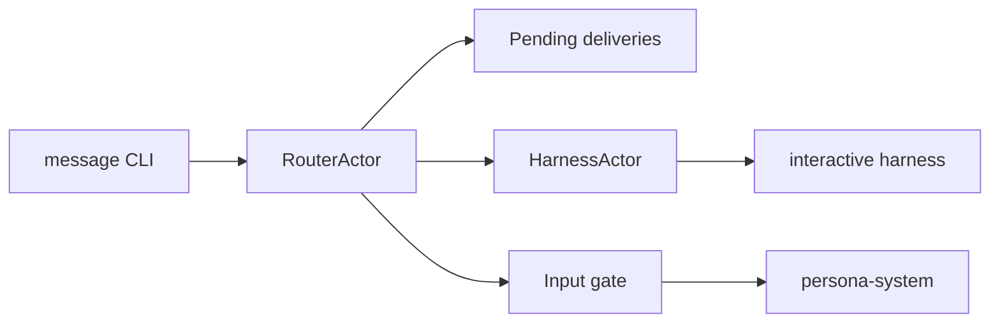

# Persona Router Architecture

`persona-router` is Persona's delivery state machine.

The router must treat human focus and non-empty prompt buffers as delivery
hazards. Delivery is event-driven: once blocked, it waits for the next relevant
event rather than checking repeatedly.
