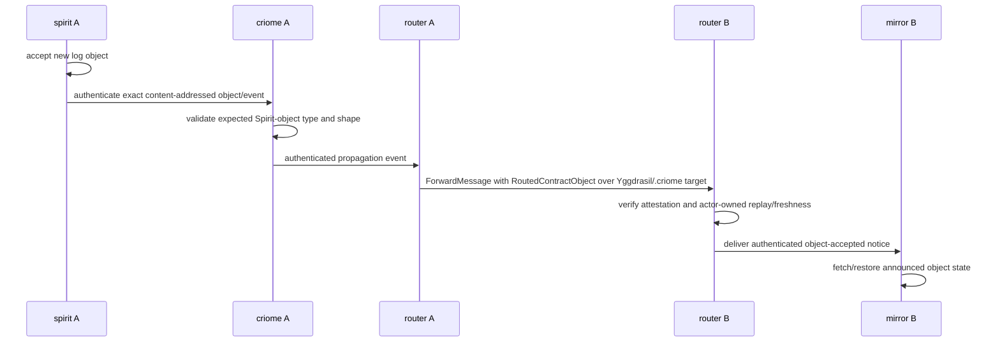

# router — architecture

*Host-to-host message relay and channel authority for Persona.*

`router` relays messages between hosts and owns live authorized-channel
state, attestation, and adjudication. Since messenger-promotion packet 3.2b
it is host-to-host ONLY: the local message ledger, inbox, and local delivery
are the `message` component's durable state, and every local message
operation on this daemon refuses typed. A stamped submission is accepted
solely as the outbound relay entry — the recipient must already resolve to
an installed remote route — and the inbound peer leg (`ForwardMessage` under
criome attestation) still delivers to local harness endpoints until the
messenger handoff replaces that final hop. Router state persists in its own
`router.sema` database through `sema-engine`.

## 0 · TL;DR

The router owns host-to-host routing, channel policy, and attestation. It
does not own local messaging (the messenger's), OS backends, terminal byte
transport, or contract definitions.

```mermaid
flowchart LR
    "signal-message" -->|"message input frame"| "RouterRuntime"
    "signal-router" -->|"observation query frame"| "RouterRuntime"
    "meta-signal-router" -->|"channel policy frame"| "RouterRuntime"
    "RouterRuntime" -->|"apply input"| "RouterRoot"
    "RouterRuntime" -->|"apply meta policy"| "RouterRoot"
    "RouterRuntime" -->|"apply observation"| "RouterObservationPlane"
    "RouterObservationPlane" -->|"read facts"| "RouterRoot"
    "RouterObservationPlane" -->|"read channel records"| "sema-engine"
    "RouterRoot" -->|"registered delivery targets"| "HarnessRegistry"
    "RouterRoot" -->|"channel check / adjudication"| "ChannelAuthority"
    "RouterRoot" -->|"typed adjudication request"| "MindAdjudicationOutbox"
    "RouterRoot" -->|"delivery attempt"| "HarnessDelivery"
    "RouterRoot" -->|"pending state"| "DeliveryQueue"
    "HarnessDelivery" -->|"typed terminal delivery request"| "harness"
    "RouterRoot" -->|"router-owned records"| "sema-engine"
```

## 1 · Component Surface

`router` exposes:

- a library surface for delivery decisions;
- an ordinary async task-backed component daemon shell in
  `src/component_daemon.rs`; it is runtime policy owned here, not generated
  from an Interface;
- a working socket `router.sock` at mode 0600 — internal
  Signal traffic only. Frames arriving from in-engine
  components tag as `MessageOrigin::Internal(ComponentName)`.
  External engine-owner ingress arrives through
  `message`'s `message.sock` (mode 0660) and
  is forwarded to router with `MessageOrigin::External(...)`
  already minted by the message daemon from SO_PEERCRED.
  The daemon applies the socket modes carried by the signal-encoded
  `signal-router::RouterDaemonConfiguration` before sockets are reported
  usable.
- a separate meta-policy socket at mode 0600 for
  `meta-signal-router` channel-authority orders (`Grant`, `Extend`,
  `Revoke`, `Deny`). The meta socket uses triad-runtime's
  length-prefixed process envelope around contract-local
  `meta-signal-router` frames, and routes to `RouterRoot` through
  `ApplyMetaRouterPolicy`;
- a `router` CLI surface that accepts one Dotos `signal-router` request
  observation request, sends one length-prefixed `signal-router::Frame`
  to the working socket, and prints one Dotos `signal-router` reply.
  It is the working-contract client, not a message-ingress client;
- a `meta-router` CLI surface that accepts one Dotos
  `meta-signal-router` channel-policy order, sends one authority-defined
  meta frame to the meta socket, and prints one Dotos reply;
- `router-write-configuration`, a text-edge bootstrap helper that accepts one
  NOTA `ConfigurationWriteRequest` and writes the binary rkyv startup file
  consumed by `router-daemon`;
- a Signal-frame daemon ingress for `signal-message`
  `StampedMessageSubmission` and `InboxQuery` frames;
- a startup bootstrap reader for manager-written
  `signal-router::RouterBootstrapDocument` rkyv archives. The
  router no longer owns a private duplicate of the bootstrap record
  vocabulary and does not parse text in the daemon; it converts
  the binary contract records into internal `RouterInput` values at
  the daemon boundary;
- a Kameo `RouterRuntime` that starts, stops, and exposes the router actor
  tree as `ActorRef<RouterRuntime>`;
- a Kameo `RouterRoot` that owns live routing state behind the runtime;
- a Kameo `HarnessRegistry` that owns registered harness delivery targets;
- a Kameo `ChannelAuthority` that owns live authorized-channel records and
  adjudication-pending records;
- a router actor operation for installing the current first-stack structural
  channels during Persona engine setup;
- a router actor operation for applying typed `signal-mind` channel
  grants and retrying parked messages through the normal delivery path;
- a router actor operation for applying typed `meta-signal-router`
  channel-policy orders. `Grant` installs a channel through
  `ChannelAuthority`, `Extend` updates channel lifetime by
  daemon-minted identifier, `Revoke` tombstones the channel by
  daemon-minted identifier, and `Deny` closes a parked adjudication
  request;
- a Kameo `MindAdjudicationOutbox` that owns typed
  `signal-mind` adjudication requests. Transitional: this in-memory
  outbox plus the typed `signal-mind::AdjudicationRequest` projection
  is the current shape; the destination is router→mind via Signal frames on
  the live mind socket once the mind daemon's transport lands;
- a Kameo `HarnessDelivery` that owns terminal delivery attempts as the
  dedicated blocking plane;
- a Kameo `RemoteRouterRegistry` that owns the cross-host route table:
  `RemoteRouterIdentity → TailnetAddress` (from `RegisterRemoteRouter`
  bootstrap operations) and recipient `ActorIdentifier →
  RemoteRouterIdentity` (from `RegisterActor` whose `home` is `Some`).
  `ResolveRemoteRoute { recipient }` answers the seam in
  `RouterRoot::retry_pending` after the local harness lookup misses;
- a Kameo `RouterPeerDelivery` (`peer_delivery.rs`) that is the outbound
  network twin of `HarnessDelivery`: `DeliverRemote` opens one
  `TcpStream::connect`, builds one `signal-router::ForwardMessage` frame,
  writes one length-prefixed frame, reads one
  `ForwardAccepted`/`ForwardRefused` reply. One connection = one forward;
- a hand-wired `TailnetForwardIngress` (`router.rs`) that implements
  `triad_runtime::AsyncConnectionRuntime<TcpStream>`: it decodes only the
  `signal-router::ForwardMessage` request, verifies the attestation off the
  mailbox via the `ForwardAttestationVerifier` seam, asks the runtime to
  apply the forwarded message, and writes the single typed reply. It holds
  the live `ActorRef<RouterRuntime>`. The listener binds eagerly in
  `RouterRuntime::on_start` (the mirror pattern) when a tailnet listen
  address is configured;
- a Kameo `RouterObservationPlane` that answers `signal-router`
  observation queries (`RouterSummaryQuery`, `RouterMessageTraceQuery`,
  `RouterChannelStateQuery`) by reading `RouterRoot` facts and
  `RouterTables` channel records; replies are published Interface records.
  The daemon connection path accepts length-prefixed `signal_router::Frame`
  requests on
  `router.sock` alongside the existing stamped `signal-message` ingress
  frames, then dispatches observation requests through `RouterRuntime`
  to `RouterObservationPlane`. Subscription push for channel-state and
  delivery deltas follows the canonical five-state lifecycle named in
  `~/primary/skills/subscription-lifecycle.md`;
- exact-revision dependencies on `signal-router`, `meta-signal-router`, and
  `signal-standard`, whose Ethos authorities own the cross-component
  vocabulary. Router owns no Interface source, emitter, generated copy, or
  readable alias layer. The live binary uses the ordinary multi-listener
  component daemon shell for argument parsing, listener binding, lifecycle,
  and working-vs-meta dispatch;
- pending-delivery state;
- future subscriptions to pushed router-relevant channel and delivery events;
- typed delivery results for callers and observers.

`message` is not part of the router runtime graph. It is the
message-ingress component: its CLI talks to the `message` daemon, and
that daemon forwards typed `signal-message` requests into this daemon.
The router owns the transitional in-memory message records until those records
move behind router-owned Sema tables.

## 1.5 · Supervision-relation reception

The router daemon answers `signal-engine-management::Operation` from a
canonical `SupervisionPhase` Kameo actor alongside `RouterRoot`. The phase
actor carries `component_name`, `component_kind`,
`supervision_protocol_version`, and a cached `ComponentHealth` pushed from
the routing plane. Router reads its signal-encoded
`signal-router::RouterDaemonConfiguration` at startup, binds `router.sock`
and the optional meta socket with the configured modes, and proceeds.

The router's structural-channels install names a channel from
`Internal(Message) → Internal(Router)` carrying
`ChannelMessageKind::MessageIngressSubmission` — not the generic
`DirectMessage` kind. This distinguishes user-message ingress from internal
component traffic at the channel level.

`RouterTables::open()` opens `router.sema` through
`sema-engine::Engine`, which applies the schema-version guard per
`~/primary/skills/rust/storage-and-wire.md` §"Schema discipline".
Schema bumps land as coordinated upgrades without migrations: a store stamped
OLDER than the current `ROUTER_SCHEMA_VERSION` (or predating the version
stamp) is wiped and reinitialized at open with a logged notice — psyche
decision: the router persists no data worth migrating. A store stamped NEWER
than the running build still fails open, so a downgrade cannot destroy a
later deployment's data (witness: `tests/outdated_store_wipe.rs`).

## 2 · State and Ownership

The Kameo `RouterRuntime` is the public actor surface and owns the child actor
refs. It starts children in `on_start` and stops them in `on_stop`; there is no
non-actor runtime owner. `RouterRoot` owns live routing state for pending
deliveries and coordinates smaller actor planes. `HarnessRegistry` owns
registered harness delivery targets. `ChannelAuthority` owns the live
authorized-channel table, channel use accounting, and deduplicated
adjudication requests. `HarnessDelivery` owns terminal delivery attempts and
the blocking terminal/probe calls they require.
Durable router state lives in the router actor's own SEMA database through
`sema-engine::Engine`; no shared database actor owns router transitions and
the daemon does not open the storage kernel directly. Terminal byte movement
and verification are delegated through `harness` and then through `terminal`,
which owns the
terminal transport adapter around `terminal-cell`.
The router-to-harness delivery leg speaks the `signal-harness`
contract on the new `signal-frame` request/reply kernel; it does not
construct universal verb-classification wrappers for harness delivery.

Stored router records are typed contract records from the relation-specific
Signal contracts. Message provenance stored with accepted messages now comes
from the published `signal-message::MessageOrigin`; the older
`signal-persona-origin` vocabulary remains only at downstream edges that have
not migrated yet, such as `signal-mind` adjudication requests and channel
identifiers. The router actor decodes Signal frames, commits through
`RouterTables` into sema-engine-registered record families, and emits follow-up
frames only after the database commit succeeds.

Current MVP code still keeps the live pending queue in memory. Accepted
messages, channel grants, adjudication requests, delivery attempts, and
delivery results have a router-owned `sema-engine` table layer.
`ChannelAuthority` can
be constructed with that table layer so grants and adjudication requests are
persisted through the actor path, and `RouterRoot` writes accepted message rows
before retrying delivery. `RouterRuntime` and the daemon can receive a
`RouterTables` handle at startup, so the root actor tree can route channel work
to a durable channel authority. The router can also
install the current first-stack structural channels through the actor tree, so
Persona engine setup does not need to bypass `RouterRoot` or
`ChannelAuthority`. Those structural channels are currently an `ActorIdentifier`
projection of the first stack (`message`, `system`, `router`, `harness`,
`terminal`, `mind`, and `owner`) until the full endpoint/kind channel model is
wired through the signal contracts. The first witnesses are actor traces and
table reads: `MessageCommitted` must appear for a message before any
`DeliveryAttempted` event for that same message; a message to a locally-resolved
recipient reaches `HarnessDelivery` under local default-authorization (§2.5.1)
without a channel grant; a named table test writes channel and adjudication
records through `RouterTables` and reads them back from router-owned SEMA.

The current router can consume a typed `signal-mind::ChannelGrant` and
project it into the temporary `ActorIdentifier` channel table. The grant is installed
through `RouterRoot -> ChannelAuthority`; only then does `RouterRoot` retry
parked messages. This is the first live feedback-loop witness for the mind
choreography path. Transitional: the channel table is keyed by `ChannelTriple`
using `ActorIdentifier` plus a `ChannelKind::DirectMessage` projection, so the grant
collapses `ChannelMessageKind` into the router's current `DirectMessage` kind.
Destination: the full `ChannelEndpoint` + `ChannelMessageKind` typed key per
the `signal-mind` contract.
The router can also consume `signal-mind::AdjudicationDeny` for a
parked message and remove that message without touching the delivery actor.

Current router-owned durable family names are `router-message`,
`router-channel`, `router-adjudication-pending`,
`router-delivery-attempt`, and `router-delivery-result`, registered in
the engine catalog with per-family schema hashes. Message acceptance,
channel grants, adjudication requests, delivery attempts, and delivery
results are written through the current runtime actor path and through
`sema-engine`'s logged write surface. Pending delivery and
delivered/failed/deferred status records still need to be wired into
`RouterRoot`. Successful delivery is another router state transition: after
`harness` reports the terminal effect, the router commits the delivery
status update before post-delivery subscription events are emitted.

Every accepted message carries a typed `signal-message::MessageOrigin` from
the accepted socket relation. Origin is provenance, not an auth proof. The
production daemon default is the internal `message -> router` relation; owner/operator
origin is only a named test fixture, never hidden in frame decoding. Router
policy is local default-authorization (§2.5.1): a message whose recipient
resolves in the local harness registry is authorized by locality and flows
without a channel grant. The authorized-channel table, `ChannelAuthority`, and
the `MindAdjudicationOutbox` (an outbox actor that projects parked messages into
typed `signal-mind::AdjudicationRequest` records — not the final live mind
socket transport) stay wired for the `meta-signal-router` channel orders and for
a future policy that re-tightens local delivery, but they no longer gate the
normal local-delivery path.

Future development may add router garbage collection. GC is a router-state
operation, not an external delete loop: the router decides which delivered or
expired routing records can leave the live tables, writes an archive/generation
record first, and only then removes or compacts live entries. A separate archive
retention component may later garbage-collect archive files, but it does not own
the router's live delivery truth.

## 2.5 · Authority direction — channel grants are inbound `Mutate` orders

Channel-state changes in the router are not the router's decision.
They are **`Mutate` orders received from a higher authority** through
`meta-signal-router` — `Grant`, `Extend`, `Revoke`, and `Deny`.
Mind decides at the cognitive level, Orchestrate carries the authority
to call Router's meta policy socket, and Router commits the order.

The router's discipline on receipt:

1. **Obey, then confirm.** The router does not adjudicate the grant —
   that authority lives upstream. It commits the channel-table change
   through `ChannelAuthority` and replies with a typed confirmation.
2. **Hold *possibly-mutated* state until the commit lands.** The
   issuer's `Mutate` reply is the synchronization point; the issuer
   advances its own state only on the typed confirmation. The router
   does not emit "ack" speculatively.
3. **Retract is symmetric.** A `ChannelRetract` order tombstones the
   channel through the same path; the router replies once the
   tombstone is durable.

The verb on the *outbound* path (router → mind) is different:

- `AdjudicationRequest` (router → mind for a missed channel) is a
  *request to adjudicate*, not an order — `Assert`/`Match`-shaped, not
  `Mutate`.
- `RouterSummaryQuery` / `RouterMessageTraceQuery` /
  `RouterChannelStateQuery` from `introspect` are `Match`
  (one-shot reads). Future subscriptions for channel-state and
  delivery deltas are `Subscribe`.

The shape mirrors the universal pattern (per
`~/primary/skills/component-triad.md` §"The six verbs"): the router
*observes up-tree* via Subscribe/AdjudicationRequest and *obeys
down-tree* via Mutate-received-from-authority. The router never issues
`Mutate` orders to peers; it is downstream of the authority chain, not
in it.

`signal-message`-shaped `StampedMessageSubmission` arriving on
`router.sock` is `Assert` (a new typed message fact entered the
system) — a peer-direction write, not an authority order. Routing /
delivery is the router's decision; that's why message ingress is
`Assert` and channel changes are `Mutate`.

## 2.5.1 · Local default-authorization

Local traffic is default-authorized: a message whose recipient resolves in the
local harness registry is delivered without a per-agent-pair channel grant. In
`RouterRoot::retry_pending` the harness lookup returns a delivery target for a
local recipient, and the decision path proceeds straight to `HarnessDelivery` —
it does not consult `ChannelAuthority` for a locally-resolved recipient, and it
records no `AdjudicationRequested` step and no mind-outbox entry for local
delivery. The rationale: a locally-registered actor is already an admitted
resident of this router's engine, so co-resident delivery needs no further
channel ceremony. The whole grant/adjudication/attestation apparatus is reserved
for network-crossing delivery, where the remote branch resolves a peer route and
the receiving peer verifies a criome attestation on its ingress before this same
local-delivery path runs (§2.9). The channel authority, its adjudication
requests, the mind outbox, and the `meta-signal-router` `Grant`/`Extend`/
`Revoke`/`Deny` orders (§2.5) stay intact and wired, so a future policy can
re-tighten local delivery by re-introducing the channel check; under the current
policy no live path parks a local message for adjudication or populates the mind
outbox from local delivery. This is the psyche decision for the
orchestrator-messaging build.

## 2.6 · Channel kinds

The `ChannelMessageKind` enum is the closed set of typed message
flavors the router authorizes. Today the variants are:

- `MessageIngressSubmission` — external/owner submission entering
  through `message`; distinguished from internal direct
  delivery so the structural channel
  `Internal(Message) → Internal(Router)` carries it explicitly.
- `MessageSubmission` — generic internal submission (not the
  ingress shape).
- `InboxQuery` — read against router-held message state.
- Prompt-state observations are not a router-owned terminal-safety
  gate. They need a refreshed system/terminal signal relation before
  they become routed channel kinds again.
- `MessageDelivery` — router→target delivery hop.
- `TerminalInput` / `TerminalCapture` / `TerminalResize` —
  terminal-cell input, output capture, and resize signals.
- `TranscriptEvent` — transcript stream from terminal-cell.
- `AdjudicationRequest` — router→mind adjudication request for a
  parked message.
- `DeliveryNotification` — router→subscriber notification on
  delivery success/failure.

The set is closed because every typed message that crosses a
channel has authority semantics — who may send it, what destination
shape it may target, what duration the channel can carry it for.
A typed enum gives the channel-grant authority (`mind`)
and the router enforcement layer a finite vocabulary to bind
against. Opening this enum to free identifiers would make
channel-grant policy unenumerable.

The variants reflect the wire shapes the system carries today —
message ingress (`MessageIngressSubmission` separate from
`MessageSubmission` so the structural channel into the router
distinguishes user-message ingress from internal traffic),
observation flows (focus, prompt buffer, transcript), the
delivery hop (`MessageDelivery`), the terminal I/O surface, and
the meta-channels (`AdjudicationRequest` for missed-channel
escalation, `DeliveryNotification` for subscriber feedback).
New variants are added only when a new wire shape lands; this is
not a generic data-carrying channel.

Channel-grant authority lives in `mind`: mind decides
which `(source, destination, kind)` tuples are authorized for
which channel durations. The router enforces — it commits
authorized channels and rejects (or escalates) unauthorized
messages. See §2.5 above for the authority direction.

## 2.7 · Channel duration

The `ChannelDuration` enum is the closed three-variant set:

- `OneShot` — the channel authorizes exactly one message, then
  retires. Useful for request-reply patterns where the reply
  channel exists only for the matching reply.
- `Permanent` — the channel stays authorized until explicitly
  retracted. Useful for long-lived mind↔agent channels, the
  structural channels the router installs at engine setup, and
  any long-running flow the policy layer has declared durable.
- `TimeBound(TimestampNanos)` — the channel authorizes messages
  until the carried timestamp; after that the channel cannot
  authorize. Useful for policy-driven temporary grants where a
  bounded window is the security property.

The three durations are chosen because they cover the three
shapes the channel-grant authority distinguishes: one-time, until-
retracted, and bounded-window. A finer-grain duration model
(`OneShot(n)` for n-shot, or rate-limit variants) could be added
when channel-grant authority needs it; today's three covers the
deployed authorization patterns.

Expired `TimeBound` channels cannot authorize messages — this is
an invariant of the channel table (per §4 below). Retracted
channels cannot keep authorizing — same rule. The duration is a
property of the channel record; expiry/retraction is a state
transition of that record.

## 2.8 · Rejection reasons

A router-traversing message may be rejected (rather than
delivered) for a closed set of reasons. Today's set:

- **Channel inactive** — a retained (non-local) rejection reason:
  the channel matching `(source, destination, kind)` is not present
  in the channel table, so the router parks the message and emits an
  `AdjudicationRequest` to `mind` for the missed channel; after mind
  adjudication a `ChannelGrant` results in delivery and an
  `AdjudicationDeny` retires the message. Under the current local
  default-authorization policy (§2.5.1) a locally-resolved recipient
  is never rejected for this reason; the reason and its machinery are
  retained for a future re-tightening of local policy.
- **Recipient not found** — the destination has no registered
  delivery target (no harness registered for the named
  destination, no terminal cell available). Replied as
  `SubmissionRejected { reason: RecipientNotFound }`.
- **Store rejected** — router-owned Sema persistence layer
  refused the message commit (schema mismatch, IO failure on
  durable storage). Replied as
  `SubmissionRejected { reason: StoreRejected }`. Per the
  invariant "Accepted Signal messages persist to router-owned
  Sema before delivery retry," a store failure aborts acceptance
  rather than committing a message the durable layer didn't keep.
- **Authority revoked** — the channel was retracted or expired
  between the message's submission and its delivery attempt. The
  message is parked or dropped per the active retraction
  semantics; the rejection surfaces as a delivery deferral on
  the channel's tombstone.
- **Unimplemented operation variant** — the router decoded a
  request variant it does not yet implement (per the signal-contract
  skeleton-honesty rule). Replied as
  `MessageRequestUnimplemented`; not a delivery decision per se,
  but a router-side typed refusal on an operation it cannot
  execute.

The set is closed because the router's authority surface is
finite: a message either has an authorized channel (delivered),
has no authorized channel (parked + adjudication), targets an
unknown recipient (recipient-not-found), fails the durable-commit
constraint (store-rejected), targets a now-retracted channel
(authority-revoked), or invokes a not-yet-built operation
(unimplemented). New reasons land only when a new authority
surface emerges. This is the canonical rejection enumeration;
caller code switching on a rejection observes a typed enum, never
a free string.

## 2.9 · Networked router-to-router forwarding

The router owns a networked router-to-router forwarding transport realizing
Spirit `wckt`: a message addressed to an actor that lives on a peer router
is forwarded over plain TCP on the tailnet. The pattern is lifted from
mirror's proven tailnet-TCP ingress; the router stays one concern (routing
policy + delivery state) and the transport copies mirror exactly — one
length-prefixed `LengthPrefixedCodec` frame per connection through a
forwarding-only contract.

For the spirit-vcs remote-mirroring milestone clarified in Spirit `d6he`,
Router sits after local criome authentication and before the peer-side
mirror action:



The local Spirit-to-criome trust boundary is structural: Router does not
decide whether Spirit had permission to ask criome to sign. Router accepts
only the resulting authenticated propagation as transport input and applies
its own peer attestation, freshness, replay, routing, and channel policy.

Per archived intent `57f9`, this milestone is one instance of Router's
**standardized routing protocol**: a router-typed envelope carries
routing/object metadata for a serialized contract-owned rkyv payload, and
Router stays payload-blind beyond envelope, routing, authentication, and
delivery policy. Router is the sole operational subscription matcher for
non-direct passing. Object-update fan-out is reference-shaped rather than
payload-shaped: criome stamps and authorizes the object and emits an
authorized-object reference (not the payload); Router matches subscriptions
and fans the reference to subscribers, who then fetch the rkyv object
themselves. Accepted objects are quorum-backed by default. Time-driven
pulses use an after-time contract that schedules a later check and triggers
a fresh quorum-signed acceptance if the awaited events did not occur. In the
spirit-vcs milestone the receiving mirror owns fetch/restore after the
authenticated head notice — criome auth-only, Router transport-only, mirror
the version-control substrate, one mirror per node (symmetric with the
per-system router). The mirror is the psyche's cross-machine self: an edit on
any owner machine propagates as a criome-authorized state transition, criome
holds authority on the latest approved head, and Spirit fetches it. The
mirror aspect may eventually fold into the Spirit daemon.

```mermaid
flowchart LR
    "submit on router A" -->|"local lookup misses"| "RouterRoot.retry_pending"
    "RouterRoot.retry_pending" -->|"ResolveRemoteRoute"| "RemoteRouterRegistry"
    "RemoteRouterRegistry" -->|"home + address"| "RouterRoot.retry_pending"
    "RouterRoot.retry_pending" -->|"DeliverRemote"| "RouterPeerDelivery"
    "RouterPeerDelivery" -->|"one ForwardMessage frame over TCP"| "router B TailnetForwardIngress"
    "router B TailnetForwardIngress" -->|"verify attestation off-mailbox"| "ForwardAttestationVerifier"
    "router B TailnetForwardIngress" -->|"ApplyForwardedMessage"| "router B RouterRoot"
    "router B RouterRoot" -->|"same local deliver path"| "router B HarnessDelivery"
    "router B TailnetForwardIngress" -->|"ForwardAccepted"| "RouterPeerDelivery"
```

Load-bearing decisions:

- **Eager bind in `RouterRuntime::on_start`.** The runtime is the kameo
  actor with the lifecycle hook; binding the `TcpListenerDaemon` there
  (around the runtime's own `ActorRef`, serving from a background
  `tokio::spawn`, `JoinHandle` aborted on stop) is the only correct place.
  Binding in `RouterEngine` is structurally impossible — it is a plain
  struct with no lifecycle hook and its runtime `OnceCell` inits lazily on
  the first Unix connection, so a receive-only node would never bind. The
  network `Configuration` (tailnet listen address, router identity, criome
  socket path) is threaded into the runtime's start args.
- **The seam is the unregistered-recipient park path.** When
  `RouterRoot::retry_pending` finds no local harness delivery target, it
  asks `RemoteRouterRegistry.ResolveRemoteRoute` before parking for
  adjudication. Resolvable ⇒ `RouterPeerDelivery`; unresolvable ⇒ today's
  park. Local-first ordering is preserved (the harness lookup always runs
  first). This is net-new reverse resolution, not the minted
  `network-{peer}` sender identifier (which is a sender id from an inbound
  network origin, never a recipient).
- **Loop guard.** Each pending message carries a `ForwardMarker`. A message
  that arrived via forward is marked `Forwarded`; the seam only resolves
  remote routes for `Origin` messages, so a forwarded message is
  delivered-local-or-parked only — never re-resolved to another remote
  route. The marker is set deterministically by the inbound handler,
  independent of the criome-derived origin identity (a peer `Host`/`Cluster`
  identity, so an "origin == Network" test would not fire).
- **Inbound twin of `ApplySignalMessage`.** `ApplyForwardedMessage` stamps
  the verifier-recovered peer identity as the authoritative `MessageOrigin`
  (never the wire-claimed field), sets the loop-guard marker, then runs the
  same `apply_stamped_message_submission` path — persist to sema, enqueue,
  retry — so a forward targeting a local harness delivers locally and the
  channel-auth check runs identically.
- **Verifier seam for criome (milestone 3).**
  `ForwardAttestationVerifier` is the boundary where the real criome client
  lands. Its signing side builds each outbound `RouterPeerAttestation`; its
  verifying side recovers the authoritative origin from an inbound
  attestation against the payload it covers (a tampered payload fails the
  content-digest binding). Milestone 2 ships `AcceptFixedTestIdentity`, an
  offline implementation that signs with and admits one shared fixed test
  identity, so the end-to-end forward runs with no criome daemon. The m3
  admission scaffold now exists in `ForwardAdmissionWindow`: after
  attestation verification and before forwarded-message application,
  `RouterRuntime` refuses request/attestation nonce or timestamp mismatch,
  `ClockSkew` outside the live freshness window, and `ReplayDetected` for
  repeated `(verified router identity, nonce)` pairs. The current window is
  actor-owned process-local memory; durable
  `router-forward-replay` SEMA state still lands with the real criome client.
- **Config projection.** `Configuration` projects `tailnet_listen_address →
  Option<SocketAddr>` (the one std parse at config load), `router_identity`,
  and `criome_socket_path → Option<PathBuf>` through dedicated accessors —
  not on `BindingSurface`, which is Unix-socket-only. The daemon-side
  `RouterDaemonError` carries `TailnetListener(#[from] AsyncListenerError)`
  where the IO boundaries sit; attestation-verify domain failures map to
  `RouterForwardRefusalReason` on the runtime path.

### 2.9.1 · Short-term live fabric: service-scoped `.criome` names

The short-term live fabric for testing and using networked Router is
Yggdrasil plus service-scoped CriomOS host names. This is the path that lets
the system start exercising Router as the cross-host message fabric for the
spirit-vcs remote mirroring loop while criome authentication hardens:
spirit ships version-control notices, router forwards them across hosts,
the peer mirror fetches/restores the announced head, and criome attests the
router-to-router frame once milestone 3 lands.

The naming shape is:

- `<node>.<cluster>.criome` remains the node's primary Yggdrasil host name.
- `router.<node>.<cluster>.criome` is the Router service endpoint name for
  that node, aliasing to the same Yggdrasil address.
- The Router port is not part of `/etc/hosts`; the configuration writer
  supplies the port and lowers the service endpoint to a literal
  `[yggdrasil-address]:router-port` socket address in the binary startup
  archive.

This is intentionally a component-level invariant, not a general DNS
assumption. Because Router is our component, the config writer and daemon
startup can prove the binding they rely on:

1. Horizon/CriomOS projects the peer's `.criome` service name and expected
   Yggdrasil address.
2. The Router startup archive carries the audited service name, the literal
   Yggdrasil socket address, and the peer `RemoteRouterIdentity`.
3. Startup verifies that the socket address is a Yggdrasil address and that
   the service name resolves through the CriomOS host-resolution path to the
   same address.
4. A mismatch is a startup failure, not a best-effort warning.
5. The outbound peer dial uses the literal socket address, while criome
   authentication still proves who signed the forwarded message.

So `.criome` supplies the trustworthy network target for this component:
`router.prometheus.goldragon.criome` names prometheus's Router endpoint on
the Yggdrasil fabric, and Router lowers that to the exact socket it dials.
Criome remains the message-level peer identity proof. The two are separate:
`.criome` answers *where to connect*; criome answers *who spoke*.

## 2.10 · Persistent mirror transport: origination, encrypted session, durable outbox, toggle

Four pieces extend the networked forwarding transport in §2.9 into a
persistent, encrypted, crash-durable channel a co-resident component can use
to originate a change on its own initiative, gated behind one off-by-default
switch. None of this replaces §2.9's forwarding contract or its
attestation-verify seam; it is the transport those pieces now ride, built for
the persistent both-directions quorum-gated Spirit mirror.

### Origination hand-off (`SubmitRoutedObjects`)

A co-resident component (Spirit, Criome) that wants to originate a
component-object forward — not just answer an inbound one — connects to its
own router's working socket and sends `signal-router` `Input::SubmitRoutedObjects`.
`daemon.rs::handle_working_connection` routes this one request variant to
`RouterRoot` as `ApplyRoutedObjectSubmission`; every other `signal-router::Input`
variant stays on the read-only observation plane (`ApplyRouterObservation`).
`RouterRoot::apply_routed_object_submission`:

- refuses with a typed `RouterForwardRefusalReason::MirrorDisabled` refusal
  while the mirror switch (below) is off — this op exists only to originate
  mirror traffic, so the whole op is gated, not just the objects it carries;
- otherwise mints a `PendingRouterMessage::origin_with_objects` (marked
  `ForwardMarker::Origin`), persists it to the message table and the
  outbound backlog (below), pushes it onto the live pending queue, and calls
  `retry_pending` in the same call — the submit is the delivery trigger, there
  is no poller;
- replies with the `RoutedObjectsAccepted` output carrying the minted slot.

This reuses the entire pre-existing forward path (`RemoteRouterRegistry` route
resolution, `RouterPeerDelivery::DeliverRemote`, the receiving peer's
`TailnetForwardIngress`/`apply_forwarded`) — the only change is that the origin
path now carries `routed_objects` through instead of dropping them.

### Encrypted, mutually-authenticated peer session (`PeerSession`)

`src/peer_session.rs` and `src/identity_proof.rs` replace plaintext
connect-per-forward with a persistent, per-peer session:

- **Handshake (three messages).** Initiator → responder `SessionClientHello`
  (a fresh challenge + an ephemeral X25519 public key); responder → initiator
  `SessionServerHello` (its own challenge + ephemeral key + an identity proof
  binding {responder identity, responder ephemeral key} under the initiator's
  challenge); initiator → responder `SessionClientProof` (the mirror-image
  proof under the responder's challenge). The responder answers
  `SessionAccepted` (an AEAD key-confirmation sealing the handshake transcript
  digest) or `SessionRefused`.
- **Identity proof, one root of trust.** `CriomeIdentityProver` — selected
  whenever the daemon has a `criome_socket_path` configured — asks the
  co-resident criome to BLS-`Sign` the proof and to `VerifyAttestation` an
  inbound one, the same criome identity that already backs the per-forward
  attestation (§2.9). Verification runs two checks: criome's
  `VerifyAttestation` must return `Valid` (a stranger with no registered
  identity fails `UnknownSigner`), and the router itself — not criome — checks
  the proof's nonce equals the challenge it issued for this handshake, the
  freshness check criome's stateless verify does not perform. Either failure
  is `SessionRefused`, fail-closed.
- **Key agreement and forward secrecy.** On mutual success both sides derive a
  shared secret by X25519 ECDH over the two ephemeral keys, bind it and the
  full handshake transcript through a blake3 KDF into two directional
  ChaCha20-Poly1305 keys (`SessionCipher`), and seal every subsequent forward
  under a monotonic per-direction nonce counter. The ephemeral secrets are
  consumed by the ECDH and dropped; a later compromise of the long-term BLS
  identity key cannot decrypt a recorded past session. The symmetric keys
  never leave the router process and are never persisted.
- **Persistent, reused across forwards.** `RouterPeerDelivery` holds one live
  `PeerSession` per peer address (keyed by the dialed address, serialized by
  an async mutex), established on demand and reused for every subsequent
  `DeliverRemote` to that peer; a dead session is dropped so the next forward
  re-establishes it. `TailnetForwardIngress::serve_session` is the responder
  side: it runs the handshake once, then loops opening each sealed forward
  through the SAME per-forward verify + apply path (`handle_forward`) used
  before the session existed, and sealing the reply.
- **Session-up event.** Freshly establishing (or re-establishing) a session to
  a peer produces a `PeerSessionEstablished { peer, epoch }`, returned
  alongside the ordinary delivery outcome and recorded by
  `RouterRoot::on_peer_session_established`. Together with the route-install
  push and the accepted-settle push (per-destination lanes, below), these are
  the outbound-backlog drain triggers — every one an event, no polling.

### Durable outbound backlog and push redial

`RouterRoot.pending` (the live, in-memory forward queue) is backed by a
durable `outbound_backlog` SEMA table (family `router-outbound-backlog`, keyed
by message identifier; its addition raised `ROUTER_SCHEMA_VERSION` to 2
alongside `mirror_switch`, below; the `BacklogSequence` enqueue stamp on each
row raised it to 4):

- every pending item — a local submission, a routed-object origination, or an
  accepted inbound forward parked for further routing — is written to
  `outbound_backlog` (`persist_outbound_backlog`) before it is pushed onto the
  in-memory queue, so a crash between enqueue and delivery cannot lose it;
- a row is removed (`clear_outbound_backlog`) only on a terminal outcome —
  delivered locally, accepted by the peer, or denied; it is retained across a
  transport error or a park;
- on daemon start, `RouterRoot`'s actor `on_start` hook rehydrates the whole
  in-memory queue from `outbound_backlog` (`rehydrate_outbound_backlog`)
  before admitting new work — `self.pending` no longer resets to empty on
  every boot;
- the `PeerSessionEstablished` event is the redial trigger:
  `on_peer_session_established` schedules a `DrainOutboundBacklog`
  self-message on a fresh mailbox turn (never re-entering an in-flight
  `retry_pending`), which re-runs `retry_pending` over the whole live queue.
  The reconnection itself is the "peer is back" push; there is no liveness
  poll.

### Per-destination delivery lanes — forward order is a routing property

Remote forwards dispatch OFF the root mailbox (a spawned task per forward,
settled by a `SettleRemoteForward` push), so two routers forwarding toward
each other can never cross-deadlock. Unconstrained, those spawned exchanges
would race and reorder pushes to one destination — fatal for a chained-log
consumer (mirroring) that refuses gaps. Order is therefore enforced as a
property of routing, never of any payload:

- every admitted pending item carries a `BacklogSequence` enqueue stamp
  (router-global, monotonic, persisted on its `outbound_backlog` row);
  `RouterRoot.pending` stays sorted by it, rehydration restores it
  (`outbound_forward_records` returns rows sorted at the storage boundary),
  so the queue IS the total delivery order and per-destination order falls
  out of filtering it;
- `RemoteForwardLanes` admits at most ONE in-flight remote forward per
  destination actor: `retry_pending` walks the queue in stamp order and
  dispatches only a free lane's first message; followers park in place;
- within one walk, a parked message HOLDS its destination (`HeldBacklog`):
  route resolution is an ask, so topology can change mid-walk, and a later
  message whose resolution suddenly succeeds must not overtake its parked
  predecessor;
- the settle frees the lane: an accepted settle clears the durable row and
  pushes a fresh drain (the lane-freed event) so the destination's
  next-in-order forward leaves immediately; a refused or transport-failed
  settle re-parks the message at its stamp position — the head of its own
  lane — so the retry happens in order (head-of-line blocking per
  destination, exactly the chained-log semantics) and waits for the next
  session-up or topology push, never a busy retry;
- different destinations stay concurrent: a hung exchange occupies only its
  own lane and never a mailbox turn (`tests/forward_ordering.rs` witnesses
  both properties; `tests/outbound_backlog_durable.rs` witnesses that the
  order survives a restart).

### Off-by-default mirror toggle (`SetMirrorEnabled`)

A durable, single-row `mirror_switch` SEMA table (family
`router-mirror-switch`) holds one owner-controlled boolean, read once into
`RouterRoot.mirror_enabled` at construction and flipped only through
`meta-signal-router`'s `SetMirrorEnabled` operation on the owner-only (0600)
meta socket:

- `RouterTables::mirror_enabled()` is fail-safe by construction: a missing row
  or any read/decode error both resolve to `false` — the default-off,
  ships-dark posture. Only the write side (`set_mirror_enabled`) surfaces a
  real error, so a toggle that silently failed to persist is never claimed as
  applied.
- The switch gates exactly two code paths: `apply_routed_object_submission`
  (unconditionally, since that op exists only to originate mirror traffic) and
  `apply_forwarded` (scoped: only when the inbound payload's `routed_objects`
  is non-empty — an ordinary human-message forward carries no objects and is
  never gated). All other router traffic is unaffected.
- The new value is persisted before it takes effect in the live `RouterRoot`,
  so a crash between commit and reply still leaves the persisted fact correct
  for the next restart to read.

### Session-required — the plaintext door shuts once session-capable

`TailnetForwardIngress` decides, per accepted connection, whether the daemon
is session-capable: it holds `identity_prover: Option<Arc<dyn
PeerIdentityProver>>`, which is `Some` exactly when the daemon was started
with a configured `criome_socket_path` (`RouterEngine::from_configuration` —
the same configuration switch that also selects the real criome-backed
forward-attestation verifier over the offline fixed-identity stand-in). On the
first decoded frame of a connection:

- `SessionClientHello` is served (the encrypted session handshake) only when
  `identity_prover` is `Some`; otherwise the ingress replies
  `SessionRefused(HandshakeMalformed)`;
- a bare `ForwardMessage` (the legacy plaintext, one-connection-one-forward
  shape) is served only when `identity_prover` is `None` (single-host /
  pre-criome deployment); once the ingress is session-capable, a bare
  plaintext forward is refused `ForwardRefused(SessionRequired)` **before any
  attestation is verified or the message is applied** — a valid per-forward
  attestation buys no plaintext access once the peer is expected to hold a
  session.

So a session-capable router accepts real mirror traffic only over the
encrypted, mutually-authenticated session; the plaintext path survives only as
the single-host/offline witness transport, with no session prover configured.

### Routing knowledge of component objects (psyche-noted)

- The router knows a routed object's general type only — the `ContractName`
  label (for example `signal-criome`) stamped on a `RoutedContractObject` — so
  the receiving router can hand the octets to the right co-resident component.
  It carries no further criome semantics: the router routes to the other
  host's router, which passes the object to the owning component. Criome
  concepts (quorum, founding, votes) must not appear in router vocabulary.
- Pending (psyche-noted, low short-term priority, awaiting review and
  implementation): criome messages should receive routing priority when
  resources become constrained, given their time-sensitive nature. No
  priority lane exists today; admission and delivery are order-of-arrival.

## 3 · Boundaries

This repo owns:

- delivery reducer logic;
- pending-delivery records;
- transitional router message records that are not owned by `message`;
- live authorized-channel records and adjudication-pending records;
- typed mind-adjudication outbox records for parked messages;
- router-owned Sema table layout for channels, channel indexes,
  adjudication-pending records, delivery attempts, delivery results, and meta;
- routing decisions based on typed message origin and channel state;
- subscriptions to producer event streams.

This repo does not own:

- message or system `Frame` record definitions (`signal-message`,
  future relation contracts);
- focus/window/input backend implementation;
- terminal byte movement (`terminal`);
- direct dependencies on terminal crates;
- terminal adapter execution (`harness`);
- harness lifecycle internals (`harness`);
- the Sema database of any other Persona component;
- state owned by other actors.

## 4 · Invariants

- Routing reacts to pushed events. It does not poll.
- Router daemon requests enter through the Kameo `RouterRuntime` mailbox.
- Router working requests enter the daemon as length-prefixed Signal frames,
  never as a NOTA line socket protocol.
- Router daemon startup can attach a router-owned Sema database to
  `ChannelAuthority`.
- Router daemon startup applies the managed socket modes from the
  signal-encoded configuration to `router.sock` and the meta socket.
- Networked Router live-fabric configuration may use a service-scoped
  `.criome` name (`router.<node>.<cluster>.criome`) only as an audited
  startup binding. The daemon dials a literal Yggdrasil socket address
  lowered from the managed startup archive, and startup fails closed if the
  audited service name does not resolve to that same address.
- A `.criome` service-name match proves the intended Yggdrasil network
  target for Router; it does not replace criome's forwarded-frame
  attestation as the peer-identity proof.
- Router engine setup can install first-stack structural channels through the
  actor tree.
- A typed mind channel grant installs a channel row through the actor tree
  (retained machinery); local delivery no longer depends on it (§2.5.1).
- A typed mind (or `meta-signal-router`) adjudication deny removes a stuck
  pending message by identifier without attempting delivery.
- `signal-message` frames enter through `RouterRuntime` and
  `RouterRoot`; they do not bypass the actor tree.
- Message provenance for submissions comes from
  `StampedMessageSubmission.origin`, minted by `message`; router socket
  ingress context identifies only the internal component connection.
- Plain `MessageSubmission` is not a router-ingress payload; the router returns
  typed `MessageRequestUnimplemented` instead of committing it.
- Router frame decoding does not stamp hidden `operator` or `Owner` origin.
- Owner/operator origin may appear only as explicit fixture ingress in tests or
  as an explicit external endpoint in channel records.
- Router authorization for a locally-resolved recipient is by locality
  (local default-authorization, §2.5.1); the channel table plus mind
  adjudication is retained for `meta-signal-router` orders and a future
  re-tightening of local policy, not as the local delivery gate.
- Router observation queries (`signal-router::Input`)
  are answered by `RouterObservationPlane`, which reads `RouterRoot`
  observation facts through its mailbox and reads channel records from
  router-owned Sema tables when present.
- Router observation replies are typed `signal-router::Output` records; no caller
  reads `router.sema` directly to assemble an observation answer.
- A message whose recipient resolves in the local harness registry reaches
  `HarnessDelivery` without a channel grant (local default-authorization,
  §2.5.1).
- Local delivery emits no `signal-mind` adjudication request and populates no
  mind outbox entry; the channel-adjudication apparatus is retained for
  `meta-signal-router` orders and a future re-tightening of local policy.
- Accepted Signal messages persist to router-owned Sema before delivery retry.
- One-shot and retracted channels cannot keep authorizing messages.
- Expired time-bound channels cannot authorize messages.
- Channel grants and adjudication requests can be persisted through
  router-owned Sema tables.
- Delivery attempts and delivery results can be persisted through
  router-owned Sema tables.
- `RouterRuntime` itself is an actor; it is not a wrapper around actor refs.
- Harness registration state enters through `HarnessRegistry`.
- Terminal delivery attempts stay in `HarnessDelivery`; terminal transport
  execution stays behind `harness`.
- Prompt cleanliness and human input interleaving are terminal-cell /
  terminal input-gate concerns, not router concerns.
- Every delivery attempt produces typed observable state: delivered, deferred,
  or rejected.
- Message acceptance commits before any delivery attempt is emitted.
- Delivery results update router-owned state before post-delivery events are
  emitted.
- Durable effects commit before externally visible delivery or subscription
  events.
- Future router-side push subscriptions (channel-state, delivery deltas)
  follow the canonical lifecycle: typed Subscribe request returning a
  typed snapshot reply; typed delta events; typed Retract close request;
  final typed `SubscriptionRetracted` reply carrying the same token;
  stream end. Per-subscription `StreamingReplyHandler` actors own each
  open subscription; a slow subscriber cannot block siblings.
- `ChannelAuthority` persists `adjudication_pending` records to
  `router.sema` through `RouterTables` when the daemon launches with a
  `--store` argument. The `MindAdjudicationOutbox` in-memory projection
  is a derived view, not the durable record.
- Router daemon restart with the same `--store` path observes the same
  pending-adjudication state through `RouterChannelStateQuery` and
  `RouterMessageTraceQuery` that the pre-restart daemon answered. Pending
  state survives the process boundary; the post-restart observation
  surface returns typed Signal replies, not in-memory coincidence.
- Channel and adjudication records persisted under one router schema
  version do not deserialise under a different version. `RouterTables::open`
  wipes and reinitializes a store older than the running build (logged, no
  migration — the router persists no data worth migrating) and hard-fails on
  a store newer than the running build.
- Router bootstrap records come from `signal-router`; the router
  accepts only binary rkyv `RouterBootstrapDocument` archives and converts
  contract `RouterBootstrapOperation` values into internal actor inputs.
- A co-resident component originates a component-object forward only by
  calling `SubmitRoutedObjects` on the local working socket; the router does
  not originate mirror traffic on its own initiative.
- While the mirror switch is off, the router neither originates
  (`SubmitRoutedObjects`) nor accepts (`apply_forwarded`) a forward carrying
  routed objects; ordinary `signal-message` forwarding is unaffected.
- The mirror switch's persisted state is fail-safe: a missing or unreadable
  row resolves to off, never to on.
- A pending outbound forward is durably recorded in `outbound_backlog` before
  it enters the live pending queue, and is removed only on a terminal delivery
  outcome (delivered, peer-accepted, or denied).
- A router restart rehydrates its live pending queue from `outbound_backlog`
  before admitting new work.
- Once a router's tailnet ingress is session-capable (a criome socket is
  configured), it refuses a bare plaintext `ForwardMessage` with
  `SessionRequired` before verifying or applying it; real mirror content
  crosses only the encrypted, mutually-authenticated peer session.
- A peer session's identity proof must both pass criome `VerifyAttestation`
  and answer the exact challenge nonce the verifying router issued for that
  handshake; either failure refuses the session, fail-closed.
- Peer-session symmetric keys are derived per-session from ephemeral X25519
  keys dropped after ECDH agreement; they are never persisted and never leave
  the router process.

## Code Map

```text
src/router.rs           Kameo router runtime/root, working + meta Signal daemon protocol, pending retry
src/adjudication.rs     Kameo mind-adjudication outbox for parked messages
src/channel.rs          Kameo authorized-channel and adjudication state owner
src/harness_registry.rs Kameo harness registry and delivery target owner
src/harness_delivery.rs Kameo terminal delivery blocking-plane actor
src/remote_router.rs    Kameo remote-router registry (cross-host route table)
src/peer_delivery.rs    Kameo outbound peer-forward actor (network twin of harness_delivery); holds the per-peer PeerSession
src/peer_session.rs     Encrypted, mutually-authenticated persistent peer session (X25519 ECDH + ChaCha20-Poly1305)
src/identity_proof.rs   Peer-session identity-proof seam (criome-backed prover/verifier + offline fixed-identity stand-in)
src/forward_attestation.rs ForwardAttestationVerifier trait + offline accept-fixed-identity impl (criome seam)
src/observation.rs      Kameo router observation plane (signal-router queries)
src/client.rs           thin router CLI/client over signal-router observation frames
src/meta.rs             thin meta-router CLI/client over meta-signal-router policy frames
src/cli_argument.rs     shared one-argument text/file loader for client binaries
src/component_daemon.rs ordinary multi-listener component daemon shell
src/config.rs           binary rkyv daemon configuration wrapper
src/daemon.rs           Router component hooks for the daemon shell
src/delivery.rs         pending-delivery records
src/message.rs          transitional router message records
src/tables.rs           router-owned Sema schema and message/channel/adjudication/delivery tables
src/bin/router.rs       one-line ordinary working-signal client entry point
src/bin/meta_router.rs  one-line meta policy client entry point
src/main.rs             one-line daemon entry point
tests/                  router smoke and actor-density truth tests
```

## Constraint Tests

| Constraint | Test |
|---|---|
| The component daemon shell binds working + meta sockets and answers both relation families over real Unix sockets. | `nix build .#checks.x86_64-linux.router-component-daemon-answers-working-and-meta-sockets` |
| `router` CLI reaches the working observation socket and prints a typed `signal-router::Output` reply. | `nix build .#checks.x86_64-linux.router-cli-reaches-working-observation-socket` |
| `meta-router` CLI reaches the policy socket and prints a typed `meta-signal-router::Output` reply. | `nix build .#checks.x86_64-linux.meta-router-cli-reaches-policy-socket` |
| Router daemon ingress accepts `signal-message` frames. | `nix build .#checks.x86_64-linux.router-daemon-accepts-signal-message-only` |
| Router daemon binds a separate meta socket at restricted meta-policy mode. | `cargo test --test smoke constraint_router_daemon_applies_meta_socket_mode` |
| Router meta socket accepts `meta-signal-router` frames and rejects working `signal-message` frames. | `cargo test --test smoke router_meta_connection` |
| Meta channel-policy orders mutate router channel state and remain visible through the ordinary observation surface. | `cargo test --test observation_truth meta_grant_installs_channel_visible_to_working_observation`, `cargo test --test observation_truth meta_extend_updates_channel_lifetime_in_router_tables`, and `cargo test --test observation_truth meta_revoke_disables_channel_visible_to_working_observation` |
| Router daemon ingress derives sender/origin from `RouterIngressContext`, not hidden owner/operator stamping. | `nix build .#checks.x86_64-linux.router-ingress-cannot-stamp-hidden-owner-origin` |
| Router does not depend on the `message` runtime crate. | `nix build .#checks.x86_64-linux.router-runtime-cannot-depend-on-message` |
| Router does not depend on terminal crates directly. | `nix build .#checks.x86_64-linux.router-runtime-cannot-depend-on-terminal-crates` |
| Router runtime reacts to pushed events instead of timer polling. | `nix build .#checks.x86_64-linux.router-runtime-cannot-poll` |
| Router runtime uses the current terminal owner rather than retired terminal-brand infrastructure. | `nix build .#checks.x86_64-linux.router-runtime-cannot-reference-retired-terminal-brand` |
| Stamped Signal message submissions commit through `RouterRoot` before reply. | `cargo test --test actor_runtime_truth signal_message_submission_cannot_bypass_router_root_commit_trace` |
| Unstamped Signal message submissions cannot commit on the router socket. | `nix build .#checks.x86_64-linux.unstamped-message-submission-is-not-router-ingress-payload` |
| A locally-registered recipient with no channel grant reaches the delivery actor (local default-authorization). | `nix build .#checks.x86_64-linux.router-local-recipient-delivers-without-grant` |
| Local delivery emits no typed mind adjudication request. | `nix build .#checks.x86_64-linux.router-local-delivery-emits-no-mind-adjudication` |
| A ComponentSocket-registered actor receives a locally-authorized delivery as the exact length-prefixed frame the router writes. | `nix build .#checks.x86_64-linux.router-component-socket-actor-receives-locally-authorized-delivery` |
| A one-shot channel cannot authorize a second message after use. | `nix build .#checks.x86_64-linux.router-one-shot-channel-cannot-authorize-second-message` |
| A retracted channel cannot authorize messages. | `nix build .#checks.x86_64-linux.router-retracted-channel-cannot-authorize-message` |
| An expired time-bound channel cannot authorize messages. | `nix build .#checks.x86_64-linux.router-expired-channel-cannot-authorize-message` |
| Router-owned Sema tables persist channel and adjudication records. | `nix build .#checks.x86_64-linux.router-sema-tables-persist-channel-and-adjudication-records` |
| Router runtime can wire channel authority to router-owned Sema tables. | `nix build .#checks.x86_64-linux.router-runtime-wires-channel-authority-to-router-tables` |
| RouterRoot persists accepted Signal messages before delivery retry. | `nix build .#checks.x86_64-linux.router-root-persists-accepted-signal-message-before-delivery-attempt` |
| RouterRoot persists delivery attempt and result records through router-owned Sema tables. | `nix build .#checks.x86_64-linux.router-root-persists-delivery-attempt-and-result-records` |
| Router engine setup can install first-stack structural channels through the actor tree. | `nix build .#checks.x86_64-linux.router-installs-structural-channels-for-engine-setup` |
| Router bootstrap startup vocabulary is owned by `signal-router`, not by private local parser records. | `cargo test --test smoke router_bootstrap_decodes_registered_harness_socket_endpoint` and `signal-router`'s `bootstrap_document_owns_line_vocabulary_for_manager_and_router` witness. |
| The mind channel-grant machinery still installs a channel row through the actor tree though local delivery needs no grant. | `nix build .#checks.x86_64-linux.router-mind-grant-machinery-intact-under-local-default-authorization` |
| A typed mind adjudication deny removes a stuck pending message by identifier without delivery. | `nix build .#checks.x86_64-linux.router-mind-deny-removes-stuck-pending-message` |
| Router source must not reintroduce pre-127 terminal-safety gates, in-band proof, owner inbox, or route-gate concepts. | `cargo test --test actor_runtime_truth router_source_cannot_reintroduce_pre_127_gate_concepts` |
| Router daemon answers `signal-router::RouterSummaryQuery` from the observation plane actor. | `nix build .#checks.x86_64-linux.router-daemon-answers-router-summary-query` |
| Router daemon connection path accepts length-prefixed published `signal-router::Frame` requests and writes typed replies without bypassing `RouterObservationPlane`. | `nix build .#checks.x86_64-linux.router-daemon-accepts-router-observation-frames` |
| Router summary counts derive from RouterRoot's accepted/pending/failed facts. | `nix build .#checks.x86_64-linux.router-summary-query-counts-accepted-pending-and-failed-messages` |
| Router message trace replies report `Routed` for a delivery-attempted message and `MessageTraceMissing` for unknown slots — no `Unknown` sentinel. | `nix build .#checks.x86_64-linux.router-message-trace-query-reports-routed-status-for-attempted-message` |
| Router channel state replies read installed-vs-missing-vs-disabled from router-owned Sema tables. | `nix build .#checks.x86_64-linux.router-channel-state-query-reads-router-tables` |
| Router channel state without tables surfaces `RouterStoreUnavailable` instead of fabricating an answer. | `nix build .#checks.x86_64-linux.router-channel-state-query-without-tables-reports-router-store-unavailable` |
| Router observation plane query counts increment in lockstep with mailbox calls — proves observation does not bypass `RouterRoot`. | `nix build .#checks.x86_64-linux.router-observation-path-cannot-bypass-router-root-facts` |
| `HarnessDelivery::DeliverHarness` handler keeps `DelegatedReply` + `context.spawn` + `tokio::task::spawn_blocking` around the sync deliver body. Future async-without-detach refactors fail this regression witness. | `nix build .#checks.x86_64-linux.harness-delivery-handler-cannot-drop-spawn-blocking-detach` |
| Router daemon restart with the same `--store` path surfaces the pre-restart pending-adjudication state through the typed observation plane. | `nix build .#checks.x86_64-linux.router-daemon-restart-surfaces-persisted-adjudication-through-observation-plane` |
| Two in-process routers forward a message over loopback TCP: router A's trace reports `ForwardedRemote`, router B verifies the attestation and delivers to its local harness, and the forward reply is `ForwardAccepted` — fully offline, no criome daemon. | `nix build .#checks.x86_64-linux.router-two-router-loopback-forward-delivers-remotely` |
| The standing router daemon originates a component-object forward over the working socket (`SubmitRoutedObjects`) and delivers it over loopback TCP, with no hand-run witness binary. | `cargo test --test end_to_end_remote_forward standing_daemon_originates_routed_object_forward_over_loopback_tcp` |
| A session-capable ingress refuses a bare plaintext `ForwardMessage` as `SessionRequired`, before verifying or applying it. | `cargo test --test end_to_end_remote_forward session_capable_ingress_shuts_the_plaintext_forward_door` |
| The mirror switch defaults off, ships inert, and toggles over the meta socket. | `cargo test --test mirror_toggle mirror_switch_defaults_off_inert_and_toggles_over_the_meta_socket` |
| The mirror switch's persisted state survives a router restart, in both the on and off directions. | `cargo test --test mirror_toggle mirror_switch_survives_router_restart_both_directions` |
| Ordinary (non-routed-object) message forwarding is not gated by the mirror switch. | `cargo test --test mirror_toggle ordinary_message_forward_is_not_gated_by_the_mirror_switch` |
| The durable outbound backlog survives a router restart and drains automatically once the peer session (re)establishes. | `cargo test --test outbound_backlog_durable outbound_backlog_survives_restart_and_drains_on_peer_session_up` |

## See Also

- `~/primary/skills/subscription-lifecycle.md` — canonical
  five-state FSM future router-side subscriptions implement.
- `../signal-message/ARCHITECTURE.md`
- `../signal-router/ARCHITECTURE.md`
- `../harness/ARCHITECTURE.md`
- `../sema/ARCHITECTURE.md`
